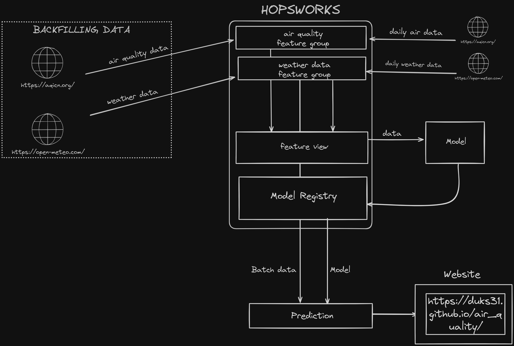

## Project Overview

The project aims to develop an air quality predictor using machine learning techniques. It utilizes a workflow depicted in the image "aqp_workflow.png" located in the "images" directory. The repository contains various documents and scripts that are essential for the project.

The project overview includes the following key components:

* Data Collection: The project involves gathering air quality data from multiple sources, such as sensors, weather stations, and government databases.

* Data Preprocessing&Backfilling: The collected data is preprocessed to handle missing values, outliers, and other data quality issues. Additionally, historical data is backfilled to ensure a complete dataset for model training.

* FTI Pipeline:
    * Feature Pipeline: The feature pipeline extracts relevant features from the preprocessed data and transforms them into a format suitable for model training.

    * Model Training: The project trains a machine learning model using the processed data to predict air quality levels based on historical data.

    * Batch Inference: The trained model is used to make predictions on new data, providing insights into future air quality levels.

## Project Structure

``` sh
│   .env
│   .gitignore
│   hopsworks-api-key.txt
│   README.md
│   requirements.txt
│   
├───.github
│   └───workflows
│           air-quality-daily.yaml
│
├───data
│       abuja-air-quality.csv
│       
├───docs
│   │   index.html
│   │   
│   └───air-quality
│       └───assets
│           └───img
│                   pm25_forecast.png
│                   pm25_hindcast_1day.png
│
├───images
│       aqp_workflow.png
│       pm25 forecast.png
│
└───notebooks
    │   .cache.sqlite
    │   air_quality_batch_inference.ipynb
    │   air_quality_feature_backfill.ipynb
    │   air_quality_feature_pipeline.ipynb
    │   air_quality_training_pipeline.ipynb
    │
    ├───air_quality_model
    │       model.json
    │
    ├───functions
    │       util.py
    │
    └───images
            feature_importance.png
            pm25_hindcast.png
```

## Demo
NOTE: The demo is no more live

https://duks31.github.io/air_quality/ 
